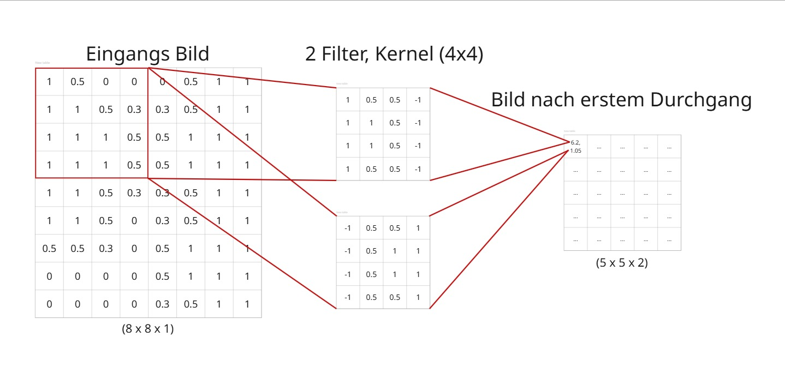
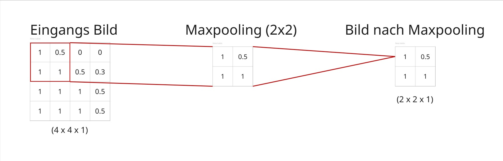
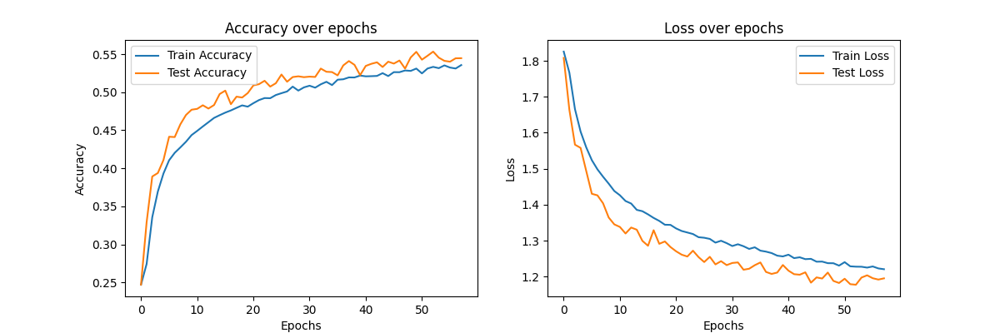
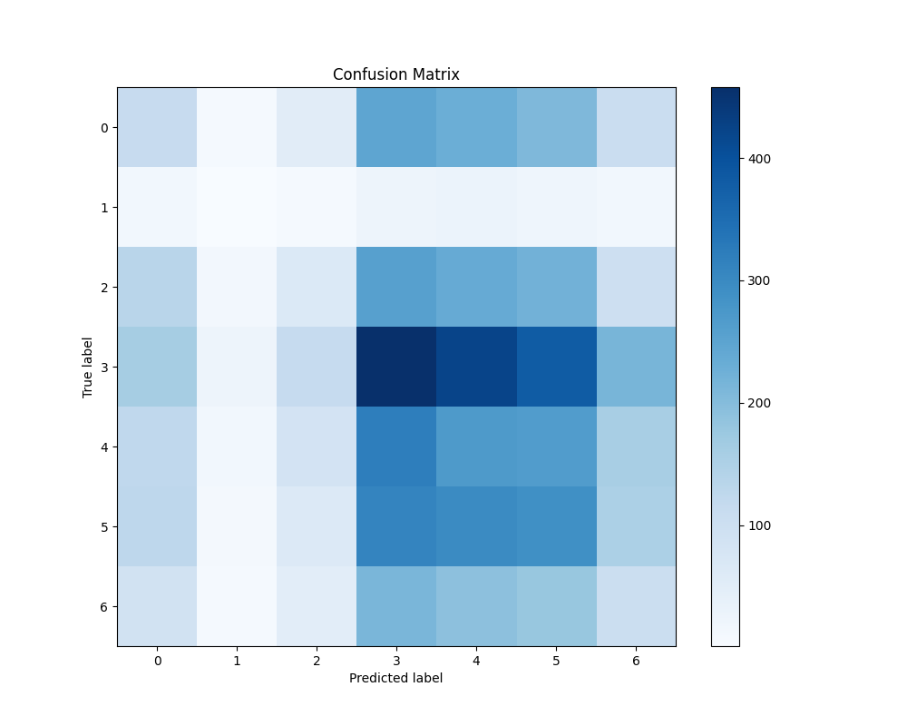

# VibeluX
Tim Schacht, Quirin Barth

## Einleitung

Wie aufwendig ist es, ein Maschine-Learning Modell zu trainieren, das einem Musikstück die beim Anhören ausgelösten Emotionen zuweisen kann?
Aus dieser Grundfrage heraus wurde ein Projektkonzept entwickelt, um mehr über diese Frage herauszufinden.
Als Ziel des Projekts wurde festgelegt, zwei Convolutional Neural Networks zu trainieren, die jeweils ihren gegebenen Input in eine von sieben Emotionen klassifizieren:
Wut, Ekel, Angst, Freude, Neutralität, Trauer und Überraschung.
Eines der Modelle wird dabei darauf trainiert, Gesichter zu erkennen, während das andere darauf trainiert wird, dieselben Emotionen in Musik zu erkennen. Die Vorhersagen beider Modelle können dann verwendet werden, um beispielsweise in einer App einem Nutzer Musik basierend auf seinem durch die Kamera erkannten aktuellen emotionalen Zustand zu empfehlen. Eine weitere Anwendungen wären versteckte interne Features, die eine Musik-App nutzen könnte, um ihren Shuffle-Algorithmus subtil an die Stimmung des Nutzers anzupassen.
Die Entwicklung einer solchen Endnutzer-Anwendung ist jedoch nicht Teil des Projektrahmens. Dieser umfasst lediglich das Aufstellen und Training beider KI-Modelle, die dazu notwendige Datenerfassung sowie die Entwicklung einer Proof-of-Concept-Lösung, mit der der Klassifikationserfolg der Modelle erkennbar gemacht werden kann, indem durch Kamerazugriff die Echtzeit-Emotionen einer Person erkannt und daraus ein Songvorschlag generiert werden soll. 

## Theorie

### Convolutional Neural Network
Ähnlich wie Multilayer Perceptrons basieren Convolutional Neural Networks, im folgenden CNN genannt, lose auf der menschlichen Wahrnehmung, indem sie mithilfe von "Filtern" auf einem Bild zunächst kleinere, grobe Merkmale erkennen und anschließend auf diesen basierende, größere Merkmale erfassen können. Diese Filter sind im Wesentlichen ein über das Bild gleitendes Fenster, das nach bestimmten Mustern sucht und ausgibt, wie stark dieses Muster vorhanden ist oder nicht. Die resultierende Karte mit Musterstärken kann dann an die folgende CNN-Schicht weitergegeben werden, um größere zusammenhängende Muster zu erkennen. Oft werden dabei viele Filter auf einmal verwendet, da jeder Filter jeweils nur ein Merkmal suchen kann. Die größe der Filter kann auch angepasst werden, und dieß wird oft der "Kernel" genannt.
Mathematisch entspricht dieser Prozess der Funktionsfaltung, da die Daten nach bestimmten Regeln über sich selbst "gefaltet" werden, was zu einer kleineren Ausgabe führt. Die Informationsdichte im Bild ändert sich jedoch basierend auf der Anzahl der Filter. Genauso wie in einem RGB Bild die Merkmale "Rot", "Grün", "Blau" in drei Schichten erfasst werden, werden die resultierenden Merkmale die von den Filtern erkannt werden ebenso in Schichten erfasst. Dadurch kann sich die Datenmenge oft Stark erhöhen, wobei das Bild von der Kernel größe abhängig gequetscht wird.  Als beispiel nehmen wir ein 8x8 Pixel Graustufen Bild, welches die Dimension (8 x 8 x 1) hat. Jetzt werden 4 Filter mit jeweils Kernel größe (2x2) auf dieses Bild angewandt. Das resultierende Bild hat jetzt die Dimension (7 x 7 x 4), also 4 Merkmalkanäle, aber nurnoch 7x7 Pixel tatsächliche Bildbreite. (3Blue1Brown, 2022)

Beispieldarstellung eines Convolution Durchlaufs, Eigendarstellung

### Maxpooling
Da die Anzahl an Datenpunkten in einem Bild sehr schnell (quadratisch mit der Bildgröße) anwächst und durch die Faltungsoperationen mit mehreren Filtern diese Informationen oftmals sogar vervielfältigt werden, lohnt es sich, die Datenmengen durch bestimmte Methoden begrenzt zu behalten. Maxpooling teilt ein Bild in Blöcke bestimmter Größe, oft 2x2 Pixel große Abschnitte, und weist diesen dann jeweils den Maximalwert unter den im Block beinhalteten Zellen zu. Dadurch wird die Datenmenge effektiv gevierteilt, ohne die am wahrscheinlich wichtigsten Merkmale zu verlieren. Es gibt natürlich auch andere Pooling-Methoden, jedoch ist Maxpooling sehr weit verbreitet. Normalerweise findet man solche Maxpooling layer nach jedem Convolutional Layer in einem CNN, before der output an den nächsten CNN Layer weitergegeben wird.

Beispieldarstellung eines Maxpooling Durchlaufs, Eigendarstellung

### Dropout
Dropout deaktiviert während des Trainings zufällig Neuronen, beziehungsweise Outputs, in einem Netzwerk und skaliert die Ausgaben so, dass sie immer noch korrekt zurückpropagiert werden können. Das Modell muss dadurch lernen, sein Wissen breiter im Netzwerk zu verteilen und sich nicht auf nur eine kleine Anzahl von Neuronen zu verlassen. Die Trainingsdauer wird dadurch zwar oft erhöht, da das Modell jetzt einem weiteren Faktor entgegenwirken muss, jedoch sorgt dies auch für ein insgesammt besser angepasstes Modell. Dies ist eine Regularisierungsmethode, die Überanpassung (englisch: Overfitting) reduziert und das Modell dazu zwingt, relevantere Merkmale zu lernen, die auf mehr Neuronen verteilt werden.

### Spektrogramm
Bei einem Spektrogramm handelt es sich um eine visuelle Darstellung der zeitabhängigen Frequenzanteile eines Signals sowie ihrer jeweiligen Intensität (Halliday et al., 2003). In der Audioverarbeitung können mit ihnen akustische Merkmale sichtbar gemacht werden, die für das menschliche Ohr nicht direkt erkennbar sind. Typischerweise werden Spektrogramme durch die Short-Time Fourier Transformation erzeugt. In diesem Prozess wird das Signal in überlappende Zeitintervalle aufgeteilt und auf jedes anschließend eine Fourier-Transformation angewandt. Die Fourier-Transformation überführt dabei eine zeitabhängige Signalfunktion in eine komplexwertige Funktion, die direkt von der Zeit und der Frequenz des Ursprungssignals abhängt.
Dadurch wird es möglich, die Frequenzanteile in einem Diagramm gegen die zeitliche Signalentwicklung aufzutragen.
Um die Darstellung einheitlicher zu gestalten, wird statt der Fourier-Transformierten, in der die Signalamplitude periodisch das Vorzeichen wechselt, in der Regel das Betragsquadrats der Fourier-Transformierten Funktion aufgetragen, welche auf diese Weise die frequenz- und zeitabhängige, immer positive Signalintensität in einem dreidimensionalen Diagramm darstellt.
Dieses kann zum Beispiel in Form einer Heat-Map als Bild gespeichert werden, wie es auch von den meisten Spektrogramm-erzeugenden Algorithmen umgesetzt wird.

### Embeddings
abc

### Cosine Similarity
def

## Umsetzung

### Datenstruktur des Repositories
Die Verzeichnisstruktur von VibeluX setzt sich folgendermaßen zusammen:

**Data**: Enthält die Verzeichnisse `archive`, für Bild-, und `audio`, für Audio-Dateien.
  - **archive**: Besteht aus den Unterordnern `test` und `train`, die jeweils PNG-Dateien für die sieben verschiedene "Haupt-Emotionen" (angry, disgusted, fearful, happy, neutral, sad, surprised) enthalten.
  - **audio**: Beinhaltet die Ordner `Processed`, für die Spektrogramm-Daten transformierter Songs, und `RAW`, für die MP3-Dateien derselben Songs.

**img**: Enhält erklärende Beispielbilder.

**Model_Training**: Enthält die folgenden Dateien und Skripte:
  - `Music_preprocessor.py`: Ein Skript zur Umwandlung von MP3-Dateien in normierte Spektrogramme.
  - `Train_face_emotion_classifier.py`: Ein Skript für das Training eines neuronalen Netzwerks zur Gesichtsemotionserkennung.
  - `Train_music_emotion_classifier.py`: Ein Skript für das Training eines neuronalen Netzwerks zur Musik-Emotions-Zuordnung.

**Songs**: was ist hier drin? ???????????????????????????????????

**generate_song_embeddings.py**: Erstellt eine JSON-Datei, die den Songdateinamen den durch ein CNN generierten Emotionen zuordnet.

**webcam_face_recognition.py**: Ein Skript für die Einbindung der Kamera des VibluX ausführenden Gerätes inklusive Gesichtserkennung und Bildformat-Normierung mittels OpenCV und der dazugehörenden Python anbindung durch das `cv2`-Moduls.

**main.py**: Das Hauptskript zur Durchführung des gesamten Prozesses der Gesichtsklassifikation, und anschließenden Embeddingsuche nach einem passenden Musikstück.

ALLE WEITEREN MÜSSEN ENTWEDER NOCH GENANNT ODER GELÖSCHT/SORTIERT WERDEN

### Datensammlung
Im ersten Schritt wurde eruiert, welche Daten für die Umsetzung einer Emotionszuordung zu Gesichtern und Musikstücken nötig sind.
Dabei ergab sich, dass für die Gesichtsdaten ein Datensatz benötigt wird, in dem frontal aufgenommene Nahaufnahmen von Gesichtern enthalten sind, vorklassifiziert nach den jeweilig dargestellten Gesichtsemotionen.
Ein solcher Datensatz konnte in der Online-Community Kaggle gefunden werden, in der er zur freien Weiterverarbeitung zur Verfügung gestellt wurde (Emotion Detection, 2020).
Durch die Wahl dieses Datensatzes waren aufgrund seiner Struktur somit die Anzahl an erkennbaren Emotionen auf 7 festgelegt.
Daraufhin wurden die Musikdateien für das Training des Musik-Emotions-zuordnenden Modells von der lizenzfreien Musikplattform Pixabay bezogen (Pixabay, a Canva Germany GmbH brand, o. D.). Auf dieser Seite können Musikstücke mit Tags versehen werden, nach denen getaggte Musikstücke anschließend über eine Suchfunktion identifiziert werden können. Für die Erstellung des Musikdatensatzes wurde daher nach den 7 erkennbaren Emotionen und ihren Synonymen gesucht und dabei erhaltene Suchergebnisse in den Datensatz `RAW` aufgenommen und mit der jeweils gesuchten Emotion vorklassifiziert. Es wurden für jede Emotionsklasse 80 Musikstücke herausgesucht, woraus sich eine Gesamtheit von 560 Musikstücken in dem erstellten Datensatz ergab.

### Gesichts-Klassifikations-Datensatz
Der Kaggle-Datensatz enthält 48x48 Pixel große Graustufen-Bilder, welche auf das zu erkennende Gesicht in Nahaufnahme zugeschnitten sind. Der Datensatz ist aufgeteilt in einen Trainingsdatensatz mit insgesamt 28709 Bildern und einen Validierungsdatensatz mit 7178 Bildern. Die Bilder sind nicht gleichmäßig über die sieben Emotionsklassen verteilt, also haben manche Emotionsklassen mehr Trainingsdaten als andere. In der folgenden Tabelle sind die prozentualen Anteile der einzelnen Emotionsklassen im Datensatz angegeben:

|Emotionsklasse|Prozent v. Desamtdatensatz|
|-:|:-|
|angry|13.9%|
|disgusted|1.5%|
|fearful|14.3%|
|happy|25.1%|
|neutral|17.3%|
|sad|16.8%|
|surprised|11%|

???????????????? tabellenverzeichnis und/oder tabellenmbeschreibungen (und für abbildungen ebenfalls) ja nein??????????????????

Wie hier zu sehen ist, hat die Emotionsklasse "happy" mit über 25% bei weitem die meisten Trainingsdaten. "disgusted" nimmt wiederum nur 1.5% des Trainningsdatensatzes ein, wodurch es wahrscheinlich weitaus schlechter erkannt werden wird.

### Musikdaten-Aufbereitung
Die vorklassifizierten MP3-Dateien aus dem Ordner `RAW` wurden in `Music_preprocessor.py` jeweils als 90 Sekunden lange Ausschnitte eingelesen und mittels des Python-Moduls `librosa` in 8k Bitrate geladen. Per Short-Time Fourier-Transformation wurden sie anschließend in Spektrogramme umgewandelt und in normierter Form im Ordner `Processed` gespeichert.
Dies basiert auf einer schon in der Vergangenheit erfolgreich angewandten Methode aus unterschiedlichen Papern, unter anderem Costa et al. (2016).

### Main-Programmausführung (Main muss wieder angepasst werden - ist ja noch in der präsentationsform)
Anschließend wurde `Train_face_emotion_classifier.py` verwendet, um ein CNN-Modell für die Gesichtsemotionserkennung zu trainieren.
#### Train_face_emotion_classifier.py

`Train_music_emotion_classifier.py` trainierte ein weiteres Modell zur Zuordnung von Spektrogrammen zu Emotionen.
#### Train_music_emotion_classifier.py

Über `webcam_face_recognition.py` wird auf die Gerätekamera zugegriffen, um ein Gesicht zu erfassen, zu verarbeiten und als Graustufenbild abzuspeichern.
#### Webcam_face_recognition.py

Das CNN-Modell `face_emotion_classifier.h5` ermittelt die Emotion des Gesichts.
#### face_emotion_classifier.h5

Anhand der JSON-Datei `song_embeddings.json` werden die erkannten Emotionen mit den gespeicherten Song-Embeddings verglichen, um den am besten passenden Song zu identifizieren.
#### song_embeddings.json

### Emotions-Embedding-Suche
Beide Modelle erzeugen einen emotionalen "Vektor", der das Gesicht oder die Musik einer Emotion zuordnet. Musik hat viele Facetten, und anstatt nur die primäre Emotion zu erkennen und passende Musikstücke auszuwählen, haben wir stattdessen die Cosine-Similarity verwendet, um das Musikstück oder die Musikstücke zu finden, die am besten zu allen 7 erkannten Emotionen im Gesicht passen.

## Ergebnisse und Diskussion
Die Gesichtserkennung funktioniert gut genug für unsere Verwendungszwecke, trotz eines niedrigen Accuracy Score von 0.545, wie in Abbildung 1 zu erkennen. Der niedrige Score lässt sich zum Teil durch die Verteilung der Emotionsklassifikation auf mehrere verschiedene Klassen auf einmal erklären, da die Zieldaten lediglich one-hot encoded sind, ein Gesicht jedoch oft mehr als nur exklusiv einer einzigen Emotionsklasse zugeordnet werden kann. (z.B.: Trauer und Wut teilen sich ein paar Gesichtsmerkmale)

Abbildung 1: Accuracy- und Loss-Verlauf über die trainierten Epochen. 

Abbildung 2: Confusion Matrix des Gesichtsklassifikations-Modells 
???????????????? muss angesprochen werden im Text ?????????????????

Die Musikemotionsklassifikation in der bisher umgesetzten Form ist allerdings nicht für die gedachte Anwendung geeignet. Der Loss-Wert nähert sich beim Training an 1.94 an, und die Accuracy an 0.14. Eine Accuracy von grob 0.14 entspricht jedoch dem Erwartungswert eines gleichverteilten Zufallsexperiments mit 7 Ereignissen von 1/7 und damit effektiv dem Zufall. Die schlechte Performance des Modells lässt sich sehr einfach auf den Mangel an Trainingsdaten zurückführen, da die in einem Spektrogramm enthaltene Informationsdichte sehr hoch ist, wodurch die Größe des erhobenen Datensatzes für das Modell nicht ausreicht, um Kernmerkmale erlernen zu können. Außerdem ist Musik ein sehr vielseitiges und subjektives Medium in dem Ausdruck von Emotionen. So gibt es zum Beispiel viel Musikstücke, welche man als "happy" klassifizieren könnte, welche sich aber vom Klang und Verlauf des Musikstücks nicht ähnlich zu einander sind, was die Merkmalerkennung zusätzlich erschwert.

Die Embedding Suche von Musikstücken durch Cosine-Similarity funktioniert in Tests wie erwartet. Jedoch konnten noch keine Echtdatentests mit Embeddings durchgeführt werden, da das Musikemotionsklassifikationsmodell keinen verwendbaren Trainingsstand erreichte.

## Reflexion und Ausblick
Für eine Weiterführung des Projektes und die endgültige Beantwortung der anfangs gestellten Leitfrage muss in jedem Fall der Datensatz für die Musikklassifikation stark erweitert werden.
Dabei können leider auch keine anderen der Standard-Methoden für die Vervielfältigung von Datensätzen wie Rotation, Spiegelung, oder Mutation der schon vorhandenen Daten zu Rate gezogen werden, da die Spektrogramme durch ihre Informationsdichte extrem empfindlich auf jegliche Manipulation reagieren und somit essenzielle Merkmale verloren gehen würden.

Da alle sonstigen Grundfunktionen im Projekt umgesetzt werden konnten, könnte mit einer 

## Literaturverzeichnis (APA7)
Halliday, D., Resnick, R. & Walker, J. (2003). Physik. Wiley-VCH.

Emotion detection. (2020, 11. Dezember). Kaggle. https://www.kaggle.com/datasets/ananthu017/emotion-detection-fer/data

Pixabay, a Canva Germany GmbH brand. (o. D.). Royalty-free music. Pixabay. Abgerufen am 30. März 2025, von https://pixabay.com/music/

Costa, Y. M., Oliveira, L. S. & Silla, C. N. (2016). An evaluation of Convolutional Neural Networks for music classification using spectrograms. Applied Soft Computing, 52, 28–38. https://doi.org/10.1016/j.asoc.2016.12.024
